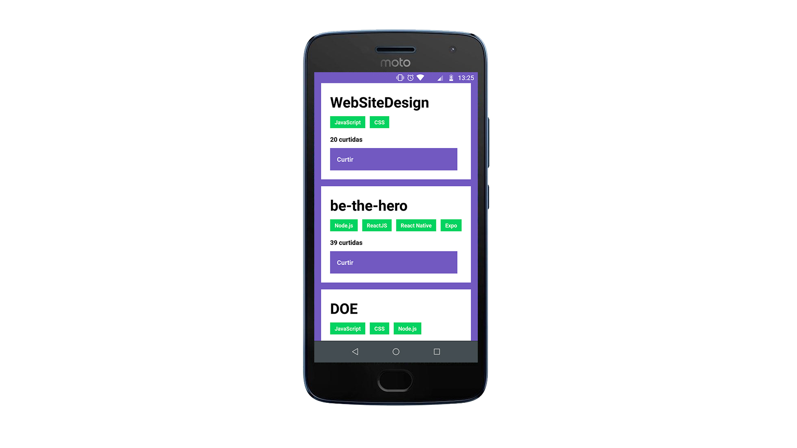
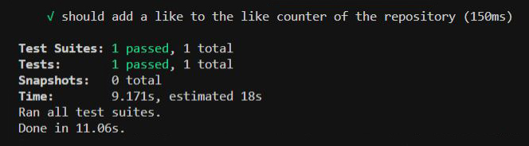

<h1 align="center">
  🚀 Conceitos de React Native 🚀
</h1>

<h3 align="center">
Desafio aplicado no Bootcamp GoStack da Rocketseat
</h3>

<h1>
  
</h1>

## Índice

- [Sobre](#-sobre)
- [Tecnologia utilizada](#-tecnologia-utilizada)
- [Objetivos](#-objetivos)
- [Testes de Validação](#-testes-de-validação)
- [Para clonar e executar o projeto](#-para-clonar-e-executar-o-projeto)
- [Para executar o teste](#-para-executar-o-teste)
- [Importante](#-importante)


---

## 🔖 Sobre

O propósito deste terceiro Desafio é continuar a aplicação desenvolvida no primeiro e segundo Desafio (Conceitos do Nodejs e ReactJS) onde o intuito da aplicação é poder armazenar repositórios do seu portfólio, que irá permitir a criação, listagem, atualização e remoção dos repositórios, e além disso permitir que os repositórios possam receber "likes".

---

## 🚀 Tecnologia utilizada

- [React Native](https://reactnative.dev/)

---

## 🎯 Objetivos

Com este desafio foi proposto fazer a ligação do Mobile (utilizando o React Native) com o Back-end (Nodejs) onde os objetivos são:

- **Listar os repositórios da API criada com o Nodejs:**
Deve ser capaz de criar uma lista de todos os repositórios que estão cadastrados na API com os campos title, techs e número de curtidas seguindo o padrão ${repository.likes} curtidas, apenas alterando o número para ser dinâmico.

- **Curtir um repositório listado da API:**
Deve ser capaz de curtir um item da API através de um botão com o texto Curtir e deve atualizar o número de likes na listagem no mobile.

---

## 📝 Testes de Validação



Para que o desafio seja válido, a aplicação teve que passar por um teste, que é:

- **Seja possível adicionar um like ao contador de likes do repositório:**
Para que esse teste passe, a aplicação deve permitir ao clicar no botão Curtir, um like seja adicionado ao repositório listado, e que essa atualização possa ser visualizada na tela.

---

## ⚙ Para clonar e executar o projeto

```bash
  # clonar o projeto
  $ git clone https://github.com/DigooDS/conceitos-react-native.git

  # acessar o projeto
  $ cd conceitos-react-native

  # executar o projeto em um dispositivo móvel (Android)
  $ yarn run react-native run-android

  # executar o projeto em um emulador IOS
  $ react-native run-ios --simulator "nome do dispositivo"

  # executar o projeto em um emulador Android
  $ react-native run-android --simulator "nome do dispositivo"
```

---

## 🛠 Para executar o teste

```bash
  $ yarn test
```

---

## 📌 Importante
Para utilizar o **Back-end** desta aplicação, será necessário acessar, clonar e seguir as informações do link do repositório (Desafio 01) abaixo:
https://github.com/DigooDS/conceitos-nodejs

Se optar por também querer ter acesso ao **Front-end** web desta aplicação, acessar, clonar e seguir as informações do link do repositório (Desafio 02) abaixo:
https://github.com/DigooDS/conceitos-reactjs

---
<i>Desenvolvido por RodrigoDS</i> 🤓